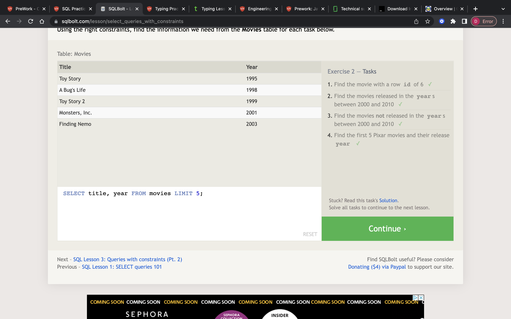
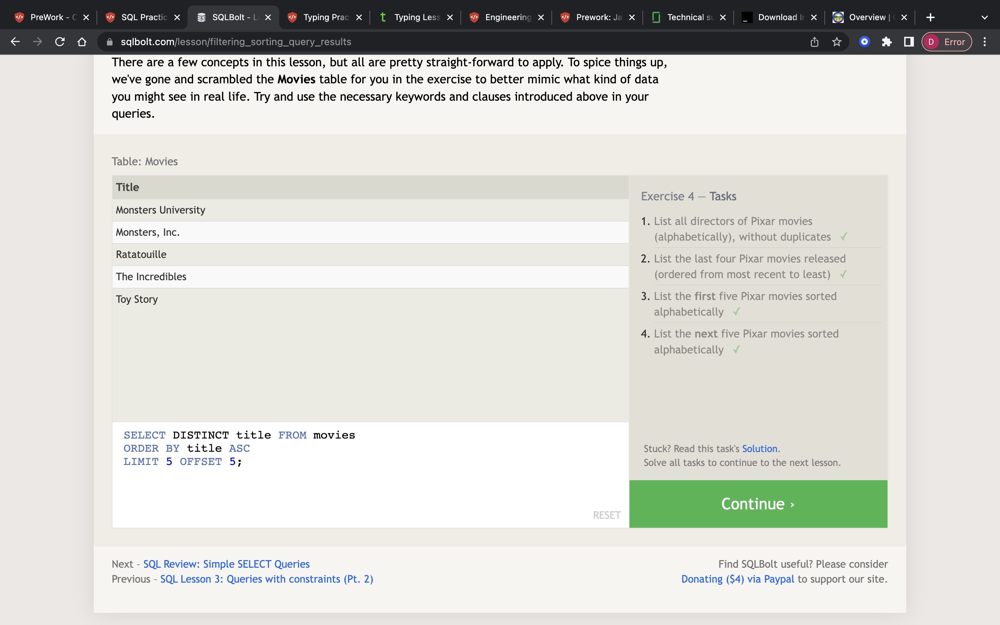
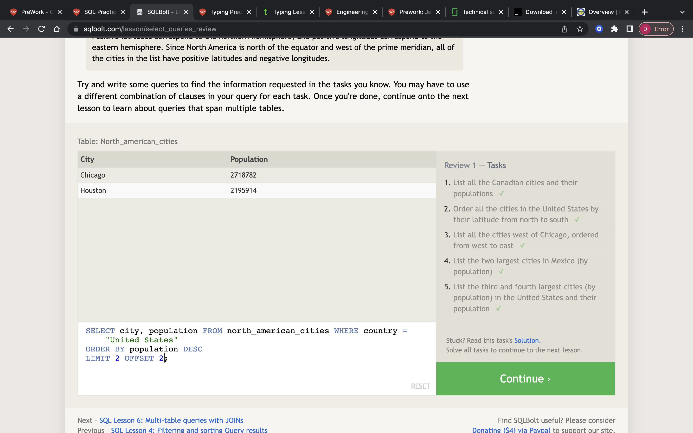
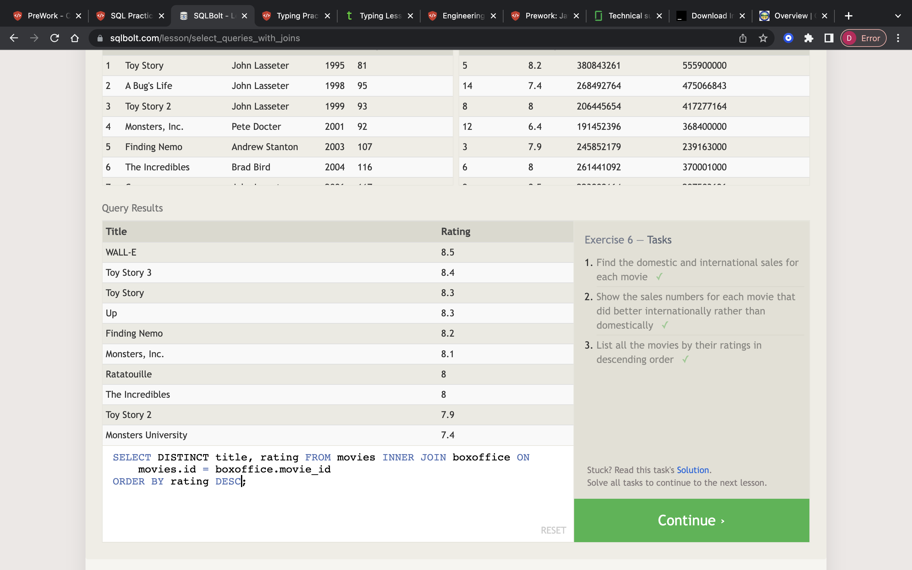
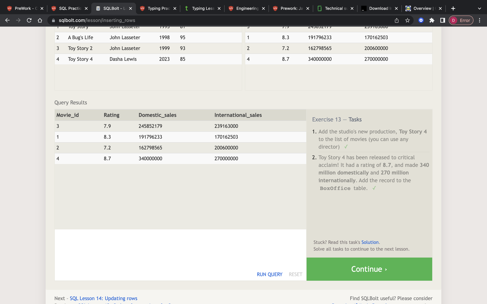
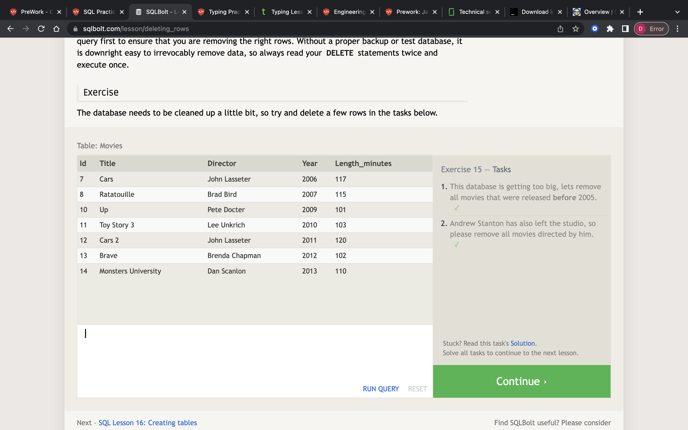
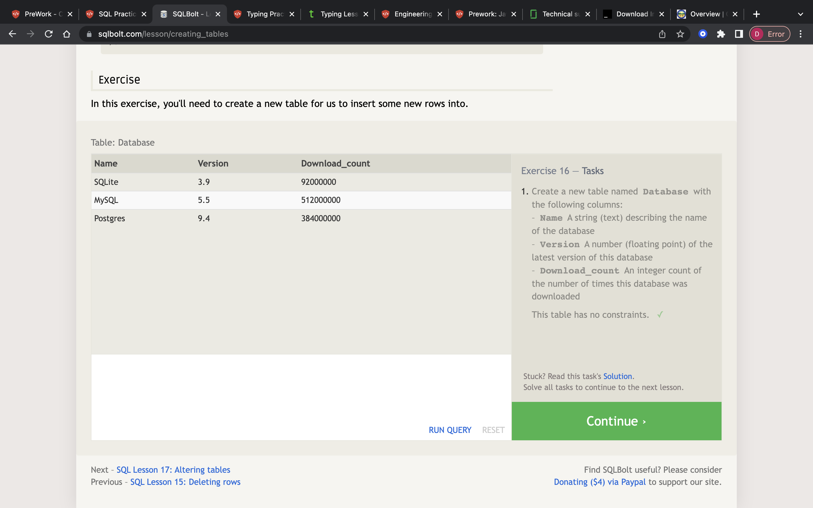
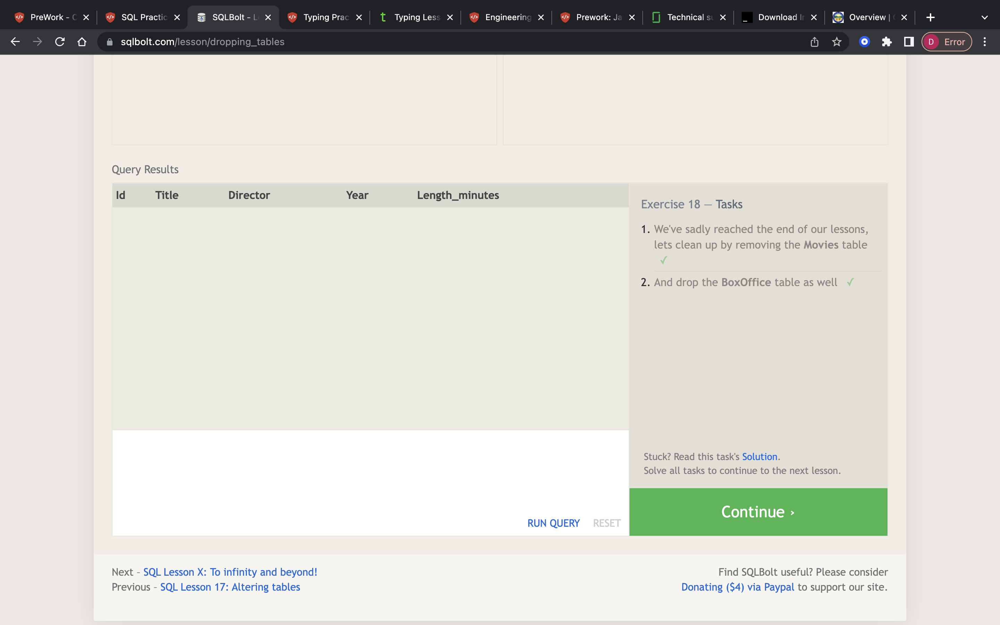

# Prep-work SQL

Each query should end with a semicolon ( ; )

## Basic Commands

SELECT selects data that can be a number, string, or any data. Strings should be enclosed with single quotes. Strings can be concatenated and math can also be done with this command.

FROM is how to specify what to get from the tables.

The \* is called Splat and is used to get ALL the columns from the table

SELECT \* FROM *table*

ORDER BY is used to sort the data pulled. Multiple things can be listed and each value is separated by a comma. The order is prioritized by what order the values are in the statement. Thing are sorted by ASCending order.

DESCending order and be specified.

SELECT \* FROM *table* ORDER BY *column*

LIMIT can limit the number of results returned. This reduces the time to run the query.

SELECT \* FROM *table* LIMIT *number to limit by*

OFFSET specifies where to start returning the data

SELECT \* FROM *table* LIMIT *number to limit by* OFFSET *number of rows to skip*

SCHEMA is the collection of tables and the their relationship to the database. A database instance can have several schemas. Visual schemas are easy to use.

### psql Schema Shortcuts

* \d                lists of all tables
* \d+               lists of all relations
* \d *table name*   list of all the columns, indexes and relations for the *table name*
* \dn               list of all schemas (namespaces)
* \l                list of all databases
* \z                list tables with access privileges

## Mid Commands

WHERE is a clause part of the LIMITing queries that filter down results. A condition is true/false statement; this is evaluated throughout the entire table and only returns results that are true.

AND operator can be used in between each condition to get multiple results. OR can be used as well but at least one of the conditions must be true. NOT can be used in front of the condition to invert the results. Any number of AND/OR commands can be used in conjunction. AND conditions are performed first then OR conditions. Parenthesis can also be used to determine the order conditions are performed

SELECT \* FROM *table* WHERE *filter conditions*

### Operators

* =     equal
* \<    less than
* \>    greater than
* <=    less than or equal
* \>=   greater than or equal
* !=    not equal
* \<>   not equal
* LIKE  string matches a pattern
  * _ matches any single character
  * % matches any number of characters
* ILIKE case insensitive string matches pattern
* SIMILAR TO  a string matches a regex pattern
* BETWEEN ... AND ....
* NOT BETWEEN ... AND ...
* IN (...)
* NOT IN (...)

NULL is empty cells in database. They cannot use = or != operators and instead use IS

IS NULL -- matches NULL values
IS NOT NULL -- matches all non NULL values

### Functions

COUNT functions takes what it is given and returns the count of how many there are as long as the data is not NULL. A COUNT(*) will return the full count of rows on a table.

COUNT DISTINCT clause changes the count to tally then number of unique values in the data.

Aliases use AS keyword with double quotes.

* MAX
  * returns the largest number in a set
* MIN
  * returns the minimum number in a set
* COUNT
  * returns s count of the number of values in a set
* COUNT DISTINCT
  * returns a count of the number of unique values in a set
* EVERY
  * returns true if all data inside is true (same as bool_and)
* AVG
  * returns the average (mean) of the set of numbers
* SUM
  * returns the sum of all the values in the set

GROUP BY clause tells the database how to group a result set. Grouping by more than one thing creates a second set of groups inside the first set. Priority is done by how they are listed. ORDER BY helps a lot when using GROUP BY. GROUP BY needs an aggregation function applied to it (right above).

### JOIN RelationSHips and JOINing Tables

Tables have relationships where each table is connected by a key (primary id). A specified id (foreign key) on one table becomes the main id (primary id) on another table and then is given another specified id (foreign key) for another related component to that row.

JOINing Tables

        SELECT \* FROM *table* JOIN *table2* ON *table.primary_key* = *table2.foreign_key*;

JOIN Types

* INNER JOIN
  * DEFAULT: returns only the rows where matches were found
* LEFT OUTER JOIN
  * returns matches and all rows from the left listed table
* RIGHT OUTER JOIN
  * returns matches and all rows from the right listed table
* FULL OUTER JOIN
  * returns matches and all rows from both tables

More than one JOIN query can be done

### DATE and TIME Functions

DATE/TIME Data Types

* TIMESTAMP
  * date and time
* DATE
  * date (no time)
* TIME
  * time (no day)
* INTERVAL
  * (interval between two dates/times) (1 day, 2:00:10)

Date String Format: YYYY-MM-DD HH:MM:SS (TIMESTAMP)

TODO also supports MONTH DAY HH:MM:SS YYYY TIMEZONE

TO_CHAR(*data type*, *pattern*) can be used to format a time stamp.

Pattern:

* HH
  * 12 hour clock hour
* HH24
  * 24 hour clock hour
* MI
  * minutes
* SS
  * seconds
* am/pm
  * displays where tune us am or pm
* YY
  * last two digits of the year
* YYYY
  * four digit year
* MM
  * month number
* Month
  * full written month of the year
* Mon
  * abbreviated month of the year
* DD
  * two digit day of the month
* Day
  * full written day of the week
* Dy
  * abbreviated day of the week
* WW
  * week number of the year
* Q
  * quarter of the yar
* TZ
  * timezone

the patterns can be stringed together to get desired format

FM can be used to remove the leading zero from the DD (FMDD)

th/st/nd can be used to end the number

CURRENT_DATE, CURRENT_TIME, and CURRENT_TIMESTAMP are most commonly used by putting them in a query.

It is common to group things by date and use TO_CHAR to do it. GROUP BY can be used to sort through the data after is it converted.

## More

UNION and UNION ALL concatenates two or more result sets to allow the use of multiple SELECT statements, retrieve the desired results, then combine them together.

UNION - only keeps unique records (no duplicates)

UNION ALL - keeps all records including duplicates

Rules for using UNION or UNION ALL:

1. There must be the same number of columns retrieved in each select statement to be combined.
2. Columns retrieved must in the same order in each select statement.
3. Columns retrieved must be similar data types

### Inserting Data

>INSERT INTO mytable
>(column, another_column, …)
>VALUES (value_or_expr, another_value_or_expr, …),
> (value_or_expr_2, another_value_or_expr_2, …),
> …;
> INSERT INTO movies VALUES (4, Toy Story 4, Director Name, table value, length);

### Updating Data

>UPDATE mytable
SET column = value_or_expr,  
    other_column = another_value_or_expr,  
    …
WHERE condition;  
> NOTE: Most people working with SQL will make mistakes updating data at one point or another. Whether it's updating the wrong set of rows in a production database, or accidentally leaving out the WHERE clause (which causes the update to apply to all rows), you need to be extra careful when constructing UPDATE statements.
> One helpful tip is to always write the constraint first and test it in a SELECT query to make sure you are updating the right rows, and only then writing the column/value pairs to update.

### Deleting Data

> Like the UPDATE statement from last lesson, it's recommended that you run the constraint in a SELECT query first to ensure that you are removing the right rows. Without a proper backup or test database, it is downright easy to irrevocably remove data, so always read your DELETE statements twice and execute once.
> If you decide to leave out the WHERE constraint, then all rows are removed, which is a quick and easy way to clear out a table completely (if intentional).
> DELETE FROM mytable
WHERE condition;

### Creating a Table

> The structure of the new table is defined by its table schema, which defines a series of columns. Each column has a name, the type of data allowed in that column, an optional table constraint on values being inserted, and an optional default value.

If there already exists a table with the same name, the SQL implementation will usually throw an error, so to suppress the error and skip creating a table if one exists

CREATE TABLE mytable (
    column *DataType* *TableConstraint* DEFAULT default_value,
    another_column *DataType* *TableConstraint* DEFAULT default_value,
    …
);

NOTE: default value was not used in the example

Data Types:

* INTEGER, BOOLEAN
* FLOAT, DOUBLE, REAL
* CHARACTER(num_char), VARCHAR(num_char), TEXT
* DATE, DATETIME
* BLOB

Table Constraints:

* PRIMARY KEY
* AUTOINCREMENT
* UNIQUE
* NOT NULL
* CHECK (expression)
* FOREIGN KEY

### Altering Tables

SQL provides a way for you to update your corresponding tables and database schemas by using the ALTER TABLE statement to add, remove, or modify columns and table constraints.

Add Columns:

        ALTER TABLE mytable
        ADD column DataType OptionalTableConstraint 
            DEFAULT default_value;

Remove Columns:

        ALTER TABLE mytable
        DROP column_to_be_deleted;

Renaming Table:

        ALTER TABLE mytable
        RENAME TO new_table_name;

### Dropping Tables

> you may want to remove an entire table including all of its data and metadata, and to do so, you can use the DROP TABLE statement, which differs from the DELETE statement in that it also removes the table schema from the database entirely.
> Like the CREATE TABLE statement, the database may throw an error if the specified table does not exist, and to suppress that error, you can use the IF EXISTS clause.
> In addition, if you have another table that is dependent on columns in table you are removing (for example, with a FOREIGN KEY dependency) then you will have to either update all dependent tables first to remove the dependent rows or to remove those tables entirely.

        DROP TABLE mytable;

## SQL PRACTICE SCREENSHOTS

